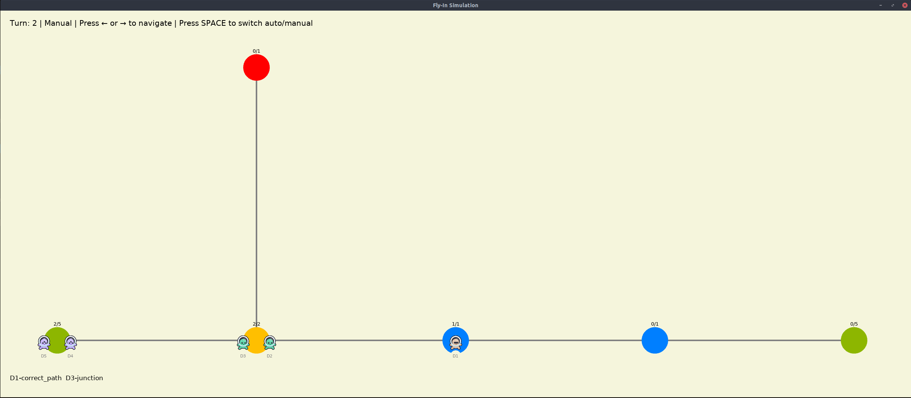
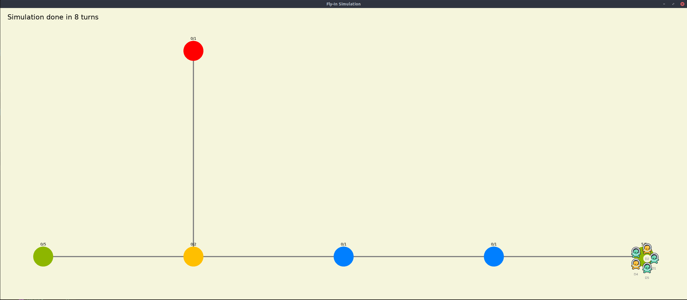

*This project has been created as part of the 42 curriculum by yghergho.*

# Fly-In

## Description
Fly-In Simulation is a Python-based turn-by-turn simulation and visualization tool for drone logistics. Its primary goal is to simulate and animate the movement of a fleet of drones as they navigate through a network of zones and connections to reach the delivery goal. 

The project bridges complex graph-based logical routing with a smooth 2D interactive visualizer, allowing users to analyze traffic, manage node capacities, and review the exact sequence of movements turn by turn.

## Instructions

### Requirements
*   **Python:** 3.10 or higher.
*   **Dependencies:** The `arcade` library is required for the 2D visualizer.
    ```bash
    make install
    ```

### Execution
Run the program via the command line by providing a map file.

```bash
python3 main.py maps/medium/01_dead_end_trap.txt
```
Using makefile:
```
make run ARGS=maps/medium/01_dead_end.txt
```

### Controls (Visualizer)
Once the simulation window opens, it starts in Manual mode. You can navigate the timeline manually using your keyboard:

- **SPACE**: Toggle between Auto-Play and Manual mode.

- **RIGHT ARROW** (→): Step forward by one turn (forces Manual mode).

- **Q**: Quit the application and generate the output.txt log file.

## Algorithm Choices and Implementation Strategy
The program is architected to strictly separate the logical simulation from the visual rendering. Instead of a "live engine" that computes data on the fly, it uses a Pre-computed History Paradigm.

1. **Parsing & Topology**: The Parser reads the input map file and instantiates a graph of Zone objects connected by Connection objects (using an adjacency dictionary).

2. **Pathfinding**: After initialization, the `Simulation` engine calculates the optimal path for every drone from its start to goal.

3. **Simulation Engine** : The simulation processes drone movements one turn at a time, updating drone statuses and capacities.

4. **Render**: The Visualizer class acts purely as a reader. It only reads the current state variables of the drones and maps, it never alters the simulation data itself.

## Visual Representation Features
The visualizer, built with Python Arcade, is designed to enhance the user experience by making complex data easily readable:

- **Dynamic Smart Orbiting**: When multiple drones wait on the exact same zone, they are mathematically distributed in a circular orbit around the hub's center based on trigonometry (math.cos, math.sin). This prevents sprite overlapping and provides an immediate visual cue of traffic jams.

- **On-Screen HUD**: Movement logs and capacities are drawn directly onto the screen. The text dynamically chunks itself to prevent overflowing past the bottom of the window, providing real-time analytical feedback.

## Example Input and Expected Output
### Example Command:

```
python main.py maps/medium/01_dead_end_trap.txt
```
### Expected Visual Behavior:
The Arcade window will open, showing a graph of colored circles (Zones) connected by lines (Connections). Drone will move across the lines. The text logs will update in the bottom left corner turn by turn.





### Expected Terminal Output (`output.txt`):
When the window is closed, the `output.txt` file, containing turn-by-turn logs, will be generated and displays itself in terminal:
 
```
D1-junction D2-junction 
D1-correct_path D3-junction 
D1-intermediate D2-correct_path D4-junction 
D1-goal D2-intermediate D3-correct_path D5-junction 
D2-goal D3-intermediate D4-correct_path 
D3-goal D4-intermediate D5-correct_path 
D4-goal D5-intermediate 
D5-goal
```

## Resources
- [Djikstra algorithm explanation](https://www.geeksforgeeks.org/dsa/dijkstras-shortest-path-algorithm-greedy-algo-7/) 

- [Python Arcade Library](https://api.arcade.academy/en/stable/index.html)

### AI Usage Statement
- Debug Game Loops: Fix issues related to the separation between on_update (logic) and on_draw (rendering) in the Arcade library.

- Math Implementation: Formulate the trigonometry required for the drone circular orbit distribution.

- Readme redaction